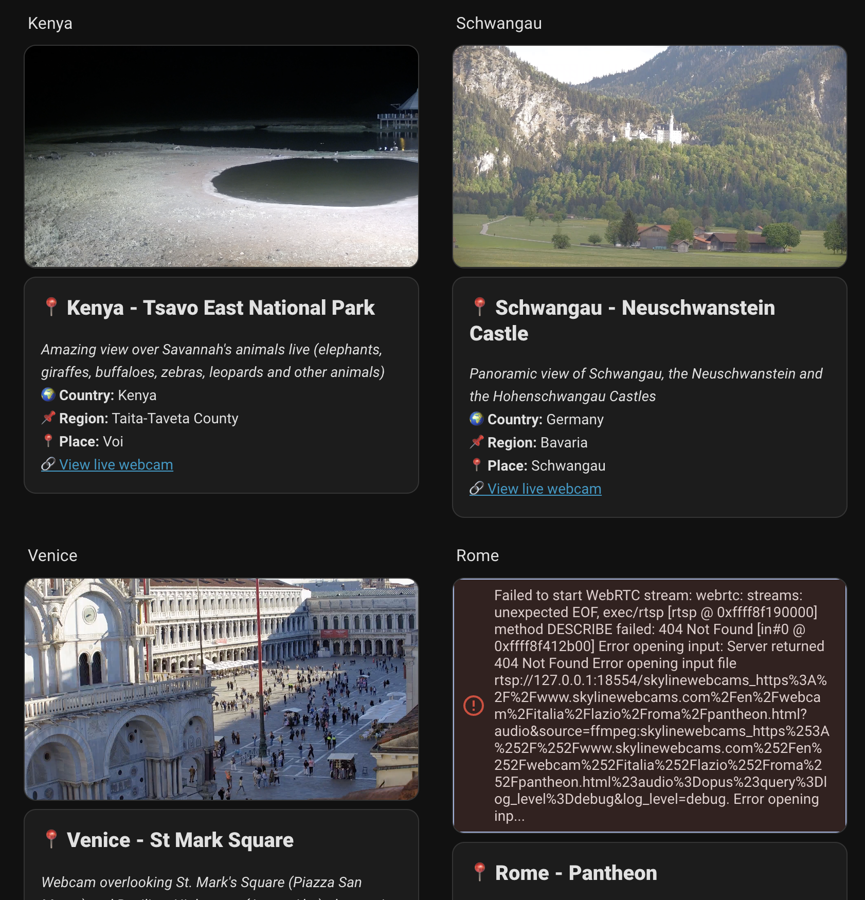

# Debugging: Camera not found on tab return

## Symptoms

- After leaving the Home Assistant browser tab for several minutes and returning, the camera card fails with various errors:
  - `500 (Internal Server Error)` on `/api/camera_proxy/...`
  - `403 (Forbidden)` on `/api/camera_proxy/...`
  - `404 (Not Found)` on `/api/hls/.../playlist.m3u8`
- JavaScript Console error: `Uncaught (in promise) {code: 'home_assistant_error', message: 'Camera not found'}`.
- Stream fails to resume even after tab is active again.

## Hypothesis

1. **HA Stream Session Expiry**: Home Assistant's internal stream component (`stream` integration) generates temporary HLS playlists and proxy URLs. These appear to expire while the tab is in the background.
2. **Proxy URL mismatch**: The `entry_id` used in the proxy URL might not match what's in `hass.data` after a period of inactivity or a background reload.
3. **Frontend State Stale**: The frontend is trying to use `authSig` and session IDs that are no longer valid on the server.
4. **Proxy lookup robustness**: While we added a fallback lookup, the 404/403/500 errors on standard HA endpoints suggest the issue is deeper than just our proxy view.

## Observations from Logs

- The `403 Forbidden` on `camera_proxy` suggests the `authSig` (JWT token) has expired.
- The `500 Internal Server Error` might indicate a server-side exception when HA tries to access a stream that has been cleaned up.
- The `404 Not Found` on `playlist.m3u8` confirms the HLS session is gone.

## Reproduction Steps

1. Open Home Assistant dashboard with SkylineWebcams card.
2. Switch to another browser tab.
3. Wait ~5-10 minutes.
4. Return to the Home Assistant tab.
5. Observe failure.
